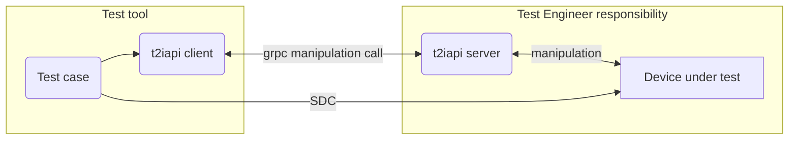

# t2iapi

t2iapi describes a product-independent interface to manipulate devices
which utilize ISO/IEEE 11073 SDC during verification.

It is utilizing gRPC to allow for language-independent implementations
of the manipulation interface at an appropriate location, be it in the
device under test or within an already existing remote control
application.

[More information on SDC.](https://en.wikipedia.org/wiki/IEEE_11073_service-oriented_device_connectivity)

For this open source project the [Contributor License Agreement](Contributor_License_Agreement.md) governs all
relevant activities and your contributions.\
By contributing to the project you agree to be bound by this Agreement and to license your work accordingly.

## Installation

### Building the package locally (Linux)

#### Python

t2iapi wheels can be built locally using the following steps using python version 3.8:

Note, this requires `protoc` and `python` to be in your `PATH`.
```shell
cd python
./build_protobuf.sh
python -m pip install wheel==0.37.0
python setup.py bdist_wheel
```

Wheels will be available in `t2iapi/python/dist`.


#### Java

t2iapi jars can be built locally using the following steps.
Note that specifying versions for protoc, grpc and the jar itself is mandatory.
Only use supported combinations of protoc and grpc, typically this can be determined
from the protoc version used by the respective [grpc-java](https://github.com/grpc/grpc-java) release.

```shell
cd java
./gradlew build
```

Jars will be available in `t2iapi/java/build/libs`.

Note that this requires protoc to be in your `PATH`.

## Usage

t2iapi usage always consists of two parties, the t2iapi server and
the t2iapi client. When running tests for a provider, the test 
engineer provides an implementation of the t2iapi server, which,
when requested, makes changes to the Device under Test to reach a
specific device state.



## Validating compatibility

If you implement t2iapi in a language other than Java or Python, or if you build the
package yourself using different versions of gRPC or protobuf than those released, we
strongly recommend verifying that your implementation correctly serializes and deserializes
all field types used by t2iapi. The repository provides reference client and server
implementations in Python together with test scenarios covering strings, booleans, uint32,
enums, repeated fields, nested messages, optional wrapper types (`StringValue`, `UInt64Value`),
and `Duration`.

Generate stubs from `src/t2iapi/integration/service.proto`, then use the reference
client or server from `tests/python/` against your own implementation, with
`tests/java/src/test/resources/integration_scenarios.json` as test data:

```mermaid
# Run the reference client against your server
python grpc_client.py <your_server_address> <path/to/integration_scenarios.json>

# Run the reference server for your client to connect to
python grpc_server.py <path/to/integration_scenarios.json>
```

## Workflow
Changes to t2iapi are guided by requirements of Dräger test tools, including [SDCcc](https://github.com/Draegerwerk/sdccc).
As such, they are only done by Dräger employees.

## Notices
The t2iapi library is not intended for use in medical products.

### ISO 9001
t2iapi was not developed according to ISO 9001.

## License
[MIT](https://choosealicense.com/licenses/mit/)